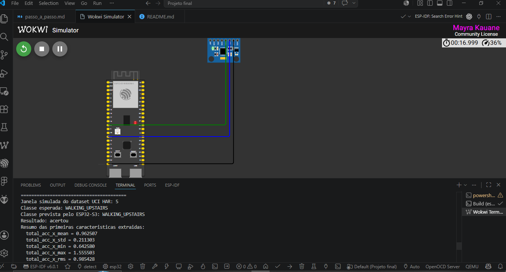

# Projeto Final - IA Embarcada e Modelos Compactos

Reconhecimento de atividade humana usando dados de acelerômetro e giroscópio, com treinamento em Python e inferência embarcada em um ESP32-S3 simulado no Wokwi.

## Objetivo

Classificar atividades humanas a partir de sinais inerciais:

- `WALKING`
- `WALKING_UPSTAIRS`
- `WALKING_DOWNSTAIRS`
- `SITTING`
- `STANDING`
- `LAYING`

O fluxo completo do projeto é:

```text
sensor -> janela com 128 leituras -> extração de características -> modelo compacto -> inferência no ESP32-S3
```

## Dataset

Foi usado o dataset público **UCI HAR - Human Activity Recognition Using Smartphones**, citado no enunciado do projeto.

O dataset contém leituras de acelerômetro e giroscópio coletadas por smartphone. Cada amostra é uma janela de 128 leituras.

Sinais usados:

```text
total_acc_x
total_acc_y
total_acc_z
body_gyro_x
body_gyro_y
body_gyro_z
```

Para cada sinal foram calculadas 5 características:

```text
média, desvio padrão, mínimo, máximo e RMS
```

Como são 6 sinais e 5 características por sinal, cada janela vira uma entrada com 30 características.

## Modelo

O modelo usado foi uma árvore de decisão (`DecisionTreeClassifier`).

A compressão foi feita limitando o tamanho da árvore:

```python
DecisionTreeClassifier(max_depth=6, min_samples_leaf=8, random_state=42)
```

Resultado:

```text
Acurácia no teste: 78,42%
Árvore completa: 593 nós
Árvore compacta: 61 nós
```

Não foi feita quantização int8. A compressão usada foi estrutural, reduzindo a quantidade de nós/regras da árvore.

## Embarque do modelo

O modelo treinado em Python foi convertido para arrays C/C++ no arquivo:

```text
firmware/wokwi/model_data.h
```

O ESP32-S3 percorre esses arrays para executar a inferência:

```text
TREE_LEFT
TREE_RIGHT
TREE_FEATURE
TREE_THRESHOLD
TREE_CLASS
```

Assim, o dispositivo não precisa rodar Python nem `scikit-learn`.

## Simulação no Wokwi

Hardware simulado:

- ESP32-S3
- MPU6050



O MPU6050 representa o sensor inercial usado no dispositivo. Ele possui:

```text
acelerômetro x/y/z
giroscópio x/y/z
```

Comandos no terminal do Wokwi:

```text
n = testa a próxima janela real do dataset UCI HAR
l = coleta 128 leituras do MPU6050 e faz inferência live
r = mostra uma leitura instantânea do MPU6050
a = liga/desliga a demo automática
```

A demo automática inicia ligada por padrão para facilitar a apresentação: ela avança pelas janelas
do dataset e periodicamente executa uma inferência live com o MPU6050.

O comando `l` executa a pipeline embarcada completa:

```text
MPU6050 -> 128 leituras -> 30 características -> árvore compacta -> classe prevista
```

## Como executar

Instale as dependências:

```bash
python -m pip install -r requirements.txt
```

Baixe o dataset:

```bash
python scripts/download_dataset.py
```

Treine e exporte o modelo:

```bash
python scripts/train_and_export.py
```

Compile o firmware:

```bash
python -m platformio run
```

Para simular no VS Code:

1. Instale as extensões PlatformIO IDE e Wokwi Simulator.
2. Abra a pasta do projeto.
3. Execute `PlatformIO: Build`.
4. Execute `Wokwi: Start Simulator`.
5. Abra o terminal `Wokwi Term...`.
6. Use os comandos `n`, `l` e `r`.

## Estrutura principal

```text
scripts/download_dataset.py       # baixa o dataset UCI HAR
scripts/train_and_export.py       # treina, compacta e exporta o modelo
notebooks/                        # análise do dataset e treinamento
firmware/wokwi/sketch.ino         # firmware do ESP32-S3
firmware/wokwi/model_data.h       # modelo embarcado em C/C++
firmware/wokwi/demo_windows.h     # janelas reais do dataset para demonstração
platformio.ini                    # configuração PlatformIO
wokwi.toml                        # configuração Wokwi
diagram.json                      # circuito da simulação
```

## Observações

No Wokwi, o sensor simulado fica praticamente parado quando não há alteração manual dos valores. Por isso, o modo `l` tende a prever atividades estáticas, como `STANDING` ou `LAYING`.

Para demonstrar diferentes classes, o modo `n` usa janelas reais do dataset UCI HAR.
